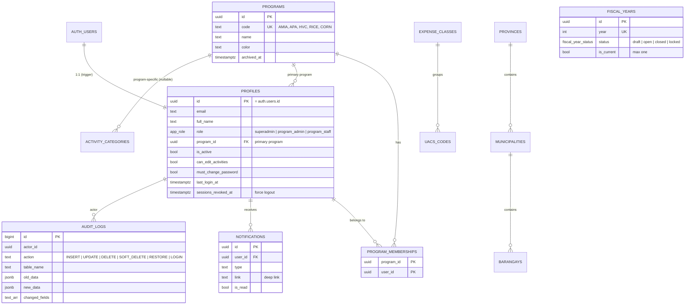
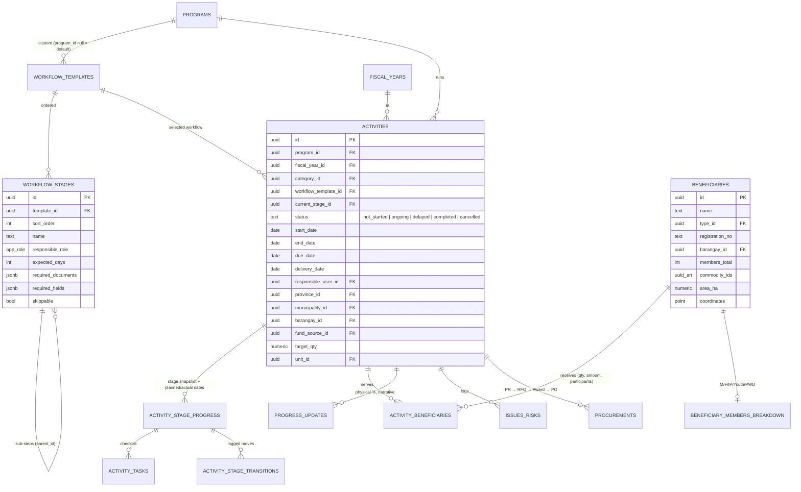
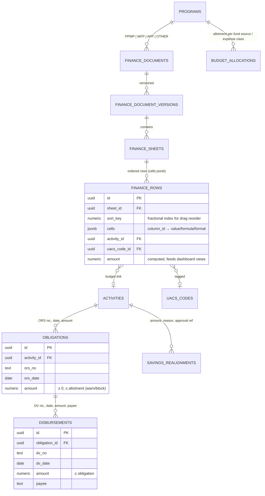
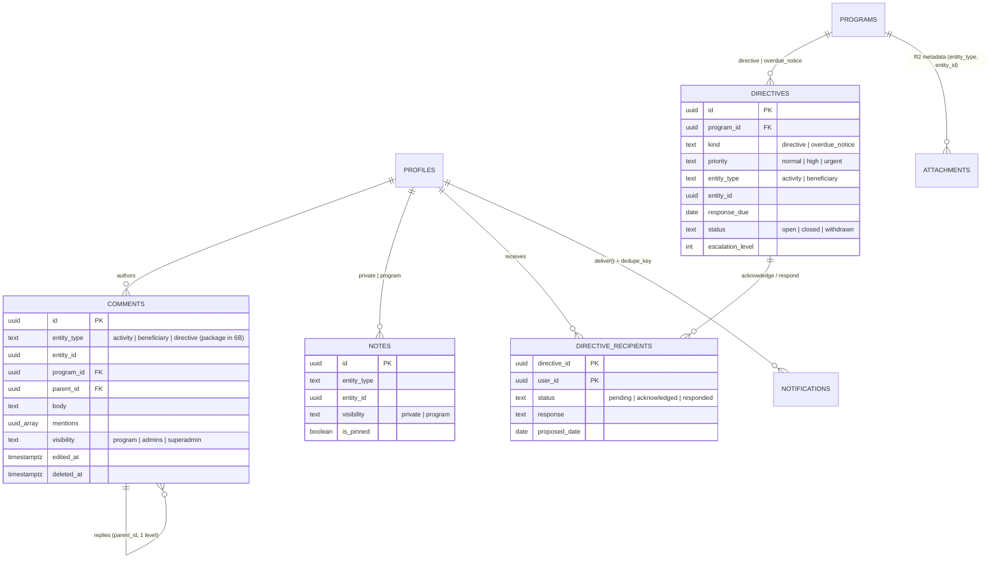

# PAYEW: Entity Relationship Design

Status legend: ✅ built (Phase 1) · 🔜 planned (phase number in brackets).

All program-scoped tables carry `program_id` (and `fiscal_year_id` where yearly), UUID PKs,
`created_at / updated_at / created_by`, soft delete via `deleted_at`, and RLS policies built on
`is_superadmin()`, `user_program_ids()`, `is_program_admin(program_id)`,
`has_program_access(program_id)` and `can_manage_program(program_id)`.

## 1. Identity, programs, master lists (✅ Phases 1–2)

Other Phase 1 tables: `fund_sources`, `commodities`, `units`, `beneficiary_types`, `app_settings` (key → jsonb).

## 2. Activities, workflow, beneficiaries (✅ Phases 4–5 · 🔜 progress/issues/procurement in 7–8)

## 3. Finance (🔜 Phase 7)

Grid design: sheet columns live in `finance_sheets.columns jsonb` (id, title, type, width, order);
each row stores its cells as jsonb keyed by column id. This keeps row/column drag-reorder cheap,
supports per-version snapshots, and lets SQL views sum the `amount` column for dashboards.

## 4. Collaboration & notifications (✅ Phase 6 · 🔜 approvals/announcements in 8, 11)

Also planned: `feedback`, `fiscal_year_rollovers`, plus views and RPCs for dashboard aggregates
(`v_program_budget_summary`, `v_activity_status_counts`, obligation aging, compliance scorecard)
and the `global_search` RPC.
