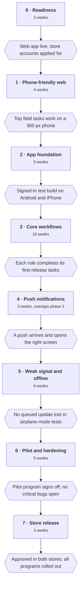

# PAYEW Mobile App Plan

Oct 1, 2026 · Alfred Brandon N. Calawa · Live version: [PAYEW Mobile App Plan](https://claude.ai/code/artifact/05148cda-257a-4f5c-a296-8784ed3e7dd5)

## Summary

**Recommendation:** make the existing web app work well on phones first (about 4 weeks). Then build one cross-platform app for iPhone and Android with React Native (Expo). It talks to the same Supabase backend the web app uses today.

The mobile app is for field work, not desk work. Staff use it to see their tasks, move activities forward, post progress with photos, raise issues and answer directives. Admins also use it to decide approvals and follow up on overdue work. Planning sheets, Excel imports, settings and full reports stay on the web.

The backend stays as it is, with three small additions: a table of phone push tokens, a sender for push notifications, and links that open the app from password-reset emails. Every permission rule (RLS) stays in the database, so the app cannot see or change anything the web app could not.

**Estimate:** 7 to 9 months from start to store release with two developers, plus a pilot with one program. Phases, checks and risks are in *Phased plan* below.

**One blocker first:** PAYEW is not yet in production (per the presentation notes). The mobile work should start after the web app is live, so the app is built on a backend that real users already rely on.

## What PAYEW is today

PAYEW is a web app for DA-CAR's Field Operations Division. It tracks each program (AMIA, APA, HVC, RICE, CORN) from plan to payment. All 12 build phases are done and covered by automated tests. It has not been deployed to production yet.

**Roles**

| Role | Scope | What they do |
| --- | --- | --- |
| Superadmin | All programs | Settings, users, audit log, decides program admins' requests, blacklists suppliers |
| Program admin | Own programs (can hold several) | Creates staff, issues directives and overdue notices, decides staff requests, approves plans, posts announcements |
| Program staff | Own program | Works activities and packages; can edit records only if *can edit activities* is on |

**Main modules:** Dashboard, My Tasks, Calendar, Activities (with workflow stages and checklists), Procurement packages, Finance (WFP/PPMP/APP sheets, allotments, ORS, deliveries, DVs), Approvals, Progress updates, Issues and risks, Comments and notes, Directives, Notifications, Beneficiaries (with map), Suppliers, Documents, Reports, Announcements, Audit log, Trash, Profile, User guide.

**How it is built**

- **Web app:** React 19 and TypeScript, TanStack Query for data, Zod for form rules. The layout already has a phone-width drawer menu, but most pages are designed for desktops.
- **Database:** Supabase Postgres. Business rules live in SQL functions (for example `activity_stage_action`, `save_obligation`, `submit_approval`, `decide_approval`, `my_work_items`, `dashboard_summary`).
- **Security:** row-level security (RLS) on every table. Roles cannot be self-assigned, and public sign-up is off. A forced logout sets `sessions_revoked_at`, which makes RLS reject any older token at once.
- **Edge Functions:** `admin-users` (create accounts, reset passwords) and `files` (signed upload and download links for Cloudflare R2, valid up to 10 minutes, 25 MB cap).
- **Notifications:** written only by database triggers and daily scheduled jobs (pg_cron at 07:00 Manila), then shown live in the web app. There is no push to phones today.
- **Sessions:** 1-hour access tokens with rotating refresh tokens. Multi-factor sign-in is switched off.

The docs disagree on web hosting: the README says Cloudflare Pages, the deployment guide says Vercel. This doesn't affect the mobile app, but the team should settle it before go-live.

## Which kind of app to build

Build in two steps: improve the web app for phones now, then build a cross-platform React Native (Expo) app. Fully native apps would mean two codebases in two new languages for a small team, so they are not worth it here.

| Option | What it is | Strengths for PAYEW | Weaknesses for PAYEW | Verdict |
| --- | --- | --- | --- | --- |
| Mobile-friendly web app (PWA) | The current site, tuned for small screens and installable on the home screen | Fast and cheap. No app store. Every fix ships at once. Reuses all current code. | Weak offline support and background sync, especially on iPhone. Push only works on iPhone once the site is installed. Uploading many camera photos is clumsy. | **Do first**, as a stopgap and to learn what field staff really use |
| Cross-platform (React Native + Expo) | One TypeScript codebase that builds real iPhone and Android apps | Same language and many of the same libraries as the web app (supabase-js, TanStack Query, Zod, date-fns). Reliable push, camera, GPS, secure storage, offline storage. One team can own both. | A second front end to maintain. App store review and release work. Web screens must be rebuilt, though the logic can be shared. | **Recommended app** |
| Cross-platform (Flutter) | One Dart codebase for both phones | Smooth performance, strong UI toolkit | New language; almost nothing reused from the TypeScript web app | Not recommended |
| Native (Swift for iPhone, Kotlin for Android) | Two separate apps | Best device integration and performance | Two codebases, two skill sets, roughly double the cost. PAYEW's forms and lists don't need what native adds. | Not recommended |

**Why React Native and Expo:** the web app's types (`src/types/database.ts`), Zod schemas, format helpers (peso amounts, Manila dates), stage rules and permission hints are plain TypeScript and can be moved into a shared package. Expo also handles builds and push credentials (EAS Build, Expo Notifications) and can ship small JavaScript fixes without a store release (EAS Update), which keeps upkeep light for a small team.

**When to revisit:** if field staff in the pilot almost never lose signal and rarely upload photos, the improved web app may be enough. In that case, delay or shrink the native app.

## What goes on mobile, and when

The first release covers work people do away from a desk or need to act on quickly: tasks, field updates, replies and decisions. Anything that needs a big screen, a spreadsheet or bulk data stays on the web.

| Feature (existing) | Staff | Program admin | Superadmin | Release | Offline in v1? |
| --- | --- | --- | --- | --- | --- |
| Sign in, change password, forgot password | Yes | Yes | Yes | First | No |
| My Tasks (`my_work_items`), tick checklist items | Yes | Yes | Yes | First | Read cached; ticks queued |
| Notifications inbox and preferences | Yes | Yes | Yes | First | Read cached |
| Activity and package detail (stages, checklist, history) | Read; edit if allowed | Yes | Yes | First | Read cached |
| Stage start / complete / skip (`activity_stage_action`) | If allowed | Yes | Yes | First | No, online only |
| Progress updates with photos | Yes | Yes | Yes | First | Yes, queued |
| Issues and risks: raise, update, resolve | Yes | Yes | Yes | First | Raise queued |
| Comments, @mentions, notes | Yes | Yes | Yes | First | Queued |
| Directives: acknowledge and respond | Yes | Yes | Yes | First | Queued |
| Issue directive, Send Overdue Notice | No | Yes | Yes | First | No |
| Approvals: submit, withdraw | Yes | Yes | No | First | No |
| Approvals: decide (`decide_approval`) | No | Yes | Yes | First | No |
| Attachments: view, upload from camera or files | Yes | Yes | Yes | First | Uploads queued |
| Announcements: read | Yes | Yes | Yes | First | Read cached |
| Dashboard: KPI cards, Needs attention, overdue lists | Yes | Yes | Yes | Second | Read cached |
| Calendar agenda view | Yes | Yes | Yes | Second | Read cached |
| Beneficiary lookup, duplicate check, GPS capture | Yes | Yes | Yes | Second | Lookup cached |
| Supplier profile (read; bank details stay admin-only) | Yes | Yes | Yes | Second | No |
| Deliveries: record with inspection photos | If allowed | Yes | Yes | Second | No, finance checks need the server |
| Post announcements | No | Yes | Yes | Second | No |
| Users: force logout, reset password | No | Own staff | Yes | Second | No |
| Reports: view key figures | Yes | Yes | Yes | Later | No |

**Stays on the web:** WFP/PPMP/APP spreadsheet grids, allotments and realignments, ORS and DV entry, Excel imports and exports, settings and master lists, workflow editor, creating users, audit log, trash and restore, full reports with print. These need a large screen or bulk editing. Finance entry also runs strict server checks that should not be bypassed or delayed by an offline queue.

**Why stage moves and approvals are online only:** `activity_stage_action` and `decide_approval` check order, fiscal-year locks, required fields and who may decide, at that moment. A decision queued offline could be applied hours later against a record that has changed. The app shows these buttons only when connected.

## How the app uses the existing backend

The app is a second client of the same Supabase project, using the same public (anon) key and the same user accounts. It calls the same tables, views and SQL functions as the web app, so every RLS rule and validation applies without change.

**Database and business rules: no change**

- Read through the same views and RPCs: `v_activities`, `my_work_items()`, `calendar_events()`, `dashboard_summary()`.
- Write only through the same RPCs the web app uses (`activity_stage_action`, `submit_approval`, `decide_approval`, `award_package`, `save_delivery`, and others). The app must never write around them, because they hold the order, lock and permission checks.
- Reuse the generated types in `src/types/database.ts`. Regenerate them for both apps in one step.

**Authentication: one small addition**

- Email and password sign-in through supabase-js, unchanged. Accounts are still created only by admins.
- `must_change_password` is honoured: the app sends users to a change-password screen before anything else, as the web guards do.
- **New:** the password-reset email links to `/reset-password` on the website. On phones, add a universal link (iPhone) and app link (Android) for that path, plus the matching Supabase redirect URL. If the app isn't installed, the link opens the website as today.

**Edge Functions: no change needed**

- `files` and `admin-users` check the caller's token and active status (`getCaller`), not the browser origin. `ALLOWED_ORIGINS` only sets CORS headers, which phone apps ignore, so native calls work as they are.
- Uploads keep the same three steps: ask `files` for a ticket, PUT straight to R2, then `confirm`. R2's CORS rule only affects browsers, so it needs no change.
- The app compresses photos on the phone before upload (as `src/lib/image.ts` does for profile photos on the web), to save data on weak signal.

**Realtime:** the web app subscribes to live notification and comment changes. The app uses the same channels only while open; push notifications cover the app when it is closed.

**Backend additions, and why each is needed**

| Addition | Why | Effect on current design |
| --- | --- | --- |
| `device_push_tokens` table (user, token, platform, last seen) with RLS: users manage only their own rows | To know which phones to notify. Nothing like it exists today. | New table, no changes to existing ones |
| `push` Edge Function + a trigger or database webhook on `notifications` inserts | To send pushes via Expo Push (which forwards to Apple and Google) | Reads the existing `notifications` rows, so `deliver()`, preferences and muting stay the single source of truth |
| Delete tokens on sign-out and on forced logout (`admin_force_logout`) | So a revoked user's phone stops getting alerts | Small change to one RPC |
| Optional: a client request ID on queued inserts (progress updates, issues, comments) | So a write retried after a dropped connection isn't saved twice | Nullable column + unique index; web app unaffected |

All additions ship as new migrations with RLS tests in `tests/db`, following the repo's rule of never editing applied migrations.

## Security, sessions, push and offline

The database stays the security boundary. The app adds protection for a phone that may be lost, shared or used on weak networks.

**Mobile security**

- The app holds only the public anon key. The service role key and R2 keys never leave Edge Function secrets, as today.
- Store the session in the phone's secure keychain (Expo SecureStore), never in plain storage.
- Encrypt the offline cache and queue (for example MMKV with a key kept in SecureStore). Never cache bank details or other admin-only fields; RLS already hides them from staff.
- Clear the cache, queue and push token on sign-out, forced logout or a switch to another account.
- Hide content in the app switcher, and block screenshots on finance and supplier screens on Android.
- Use HTTPS only; consider certificate pinning after the pilot.
- Turn on Supabase multi-factor sign-in (TOTP) for superadmins and program admins. It is off today, and admins can approve money-related requests from a phone. This is a settings change and a new screen, not a schema change.

**Sessions**

- Keep the current 1-hour access token and rotating refresh token. The app refreshes the token when it returns to the foreground.
- Add a local unlock with fingerprint, face or device PIN after 15 minutes in the background. This protects the session on a shared or lost phone and doesn't change the server.
- Forced logout already works for phones: RLS rejects any token issued before `sessions_revoked_at`. The app treats that error as "signed out" and wipes local data.
- Deactivated users fail every check, as on the web.

**Push notifications**

- Sent for the types that already exist in `notifications`: assignments, mentions, directives, overdue notices, escalations, approvals, deadlines and announcements. Preferences and muting stay as they are.
- Keep push text short and non-sensitive ("New directive from your program admin"). No peso amounts or supplier names on the lock screen.
- Tapping a push opens the right screen through the existing `link` field (for example `/activities/<id>`), mapped to an app route.
- Daily jobs fire at 07:00 Manila. Group same-day reminders into one push per person so phones aren't flooded.

**Poor connectivity and offline**

Assume weak or patchy signal in the field. Plan for full offline only on the few actions marked "queued" above.

- **Reading:** cache the last-loaded tasks, activities, notifications and announcements on the phone (TanStack Query persisted cache). Show "last updated" times and an offline banner.
- **Writing:** a local outbox holds progress updates, issues, comments, directive replies, checklist ticks and photo uploads. It sends them in order when the signal returns and shows each item's state (waiting, sent, failed).
- **Uploads:** compress photos, send one at a time, retry with backoff, and start a fresh `files` ticket if the 10-minute signed link expires.
- **Conflicts:** the server decides. If a queued item is rejected (for example a fiscal year was locked), the app keeps it, shows the server's reason, and lets the user edit or discard it. Nothing is silently lost.
- **Online only:** stage moves, approval decisions, awards and finance entries. Their buttons are disabled offline, with a short reason.

## Quality, release and upkeep

Target the low-cost Android phones common among field staff first, then iPhones.

**Accessibility**

- Meet WCAG 2.2 AA where it applies to apps: 4.5:1 text contrast, touch targets of at least 44×44 points, and labels on every button for TalkBack and VoiceOver.
- Support large system font sizes without cutting off text.
- Never use colour alone for status. The dashboard already pairs colours with icons and labels; keep that.
- Plain-language error messages, reusing the web app's `errorMessage()` wording.

**Performance**

- Cold start under 3 seconds on a mid-range Android phone.
- Lists load in pages of 25 to 50 rows, not whole tables.
- Photos compressed to about 1600 px wide before upload.
- App download size under 40 MB.

**Testing**

- Shared logic (stage rules, formatting, permissions) keeps its existing Vitest tests once moved to the shared package.
- New database pieces (push tokens, request IDs) get RLS tests in the existing PGlite suite, run by CI.
- Screen tests with React Native Testing Library; end-to-end flows with Maestro on Android and iPhone simulators.
- Manual checks with each role's seeded dev account, on a slow and flaky network (network throttling, airplane-mode toggles).
- A pilot with one program's real staff before wider release.

**App store release**

- **Accounts:** an Apple Developer Program account for DA-CAR as an organization (needs a D-U-N-S number, which can take several weeks) and a Google Play Console account. Start these in Phase 0.
- **Distribution:** PAYEW is internal and has no sign-up, so prefer private distribution: Apple Business Manager custom apps (or an unlisted App Store app) and a Google Play managed private app. A public listing also works, but needs a demo account for reviewers and a public privacy policy.
- **Store needs:** privacy policy, data-safety and privacy forms, screenshots, and a reviewer test account on a non-production project.
- **Builds:** EAS Build in CI; internal testing through TestFlight and Play internal testing.

**Maintenance**

- **Owner:** the same team that owns the web app, so backend changes and both apps move together.
- **Compatibility rule:** a database change must not break the app version currently in users' hands. Add new columns and RPCs; don't rename or remove them until old app versions are retired. Add a "minimum app version" setting in `app_settings` so the app can ask users to update.
- **Updates:** small fixes ship through EAS Update; native changes need a store release.
- **Yearly:** update to new iOS and Android versions and the yearly Expo SDK. Budget about 2 to 4 developer-weeks a year.
- **Monitoring:** crash and error reporting (for example Sentry), with personal data scrubbed.

## Phased plan

About 35 weeks end to end, or roughly 8 months with two developers, because push work overlaps the core build. Lengths are estimates for a two-person team that already knows the web codebase. Each phase ends with a gate that must pass before the next one starts.

The phone-friendly web release (phase 1) gives field staff something useful within about 6 weeks, while the app is being built.

### Phase 0 · Readiness (2 weeks)

- **Work:** deploy the web app to production and settle the hosting question. Interview 5 to 10 field staff and admins about phones, signal and daily tasks. Apply for the Apple and Google developer accounts (D-U-N-S number). Pick the pilot program.
- **Depends on:** the production checklist in `docs/DEPLOYMENT.md`.
- **Risks:** Apple organization enrolment takes weeks; web go-live slips.
- **Done when:** the web app is live, `post_deploy.sql` shows all `ok`, account applications are submitted, and the pilot program is named.

### Phase 1 · Phone-friendly web (4 weeks)

- **Work:** make the first-release screens work at 360 px wide: My Tasks, notifications, activity detail, progress updates, issues, comments, directives, approvals, announcements. Add an installable web app manifest. Use the phone camera through the existing upload flow.
- **Reuses:** all existing web code; no backend changes.
- **Risks:** wide tables and dialogs need real redesign, not just shrinking.
- **Done when:** each role completes its top five field tasks on a mid-range Android phone without zooming or sideways scrolling.

### Phase 2 · App foundation (5 weeks)

- **Work:** move shared TypeScript (types, Zod schemas, format, stage rules, permissions, API calls) into a shared package used by web and app. Set up the Expo app, navigation, design tokens, sign-in, forced password change, secure session storage, biometric unlock, error reporting, and EAS builds in CI.
- **Depends on:** phase 0 accounts for signed iPhone builds.
- **Risks:** browser-only code mixed into API files slows the move; keep the web app's tests green throughout.
- **Done when:** a seeded staff, admin and superadmin account can each sign in, be forced to change password, and be signed out by a forced logout, on test builds for both platforms. Web CI still passes.

### Phase 3 · Core workflows (10 weeks)

- **Work:** build the "First" features from the scope table: tasks, notifications inbox, activity and package detail, stage actions, checklist, progress updates, issues, comments, directives, approvals, attachments with camera, announcements.
- **Reuses:** the existing RPCs, views and the `files` Edge Function, unchanged.
- **Risks:** scope creep toward the full web app; RPC error messages that read badly on small screens.
- **Done when:** each role completes every first-release task on both platforms against a staging project, and RLS blocks a staff user from another program's records in the app, as on the web.

### Phase 4 · Push notifications (3 weeks, alongside the end of phase 3)

- **Work:** add the `device_push_tokens` table with RLS and tests, the `push` Edge Function and its trigger, token clean-up on logout, deep links from `notifications.link`, and grouping of the 07:00 reminders.
- **Depends on:** Apple push credentials and Firebase project for Android.
- **Risks:** pushes are lost or duplicated; sensitive text appears on lock screens.
- **Done when:** for each notification type, a push arrives within a minute, opens the right screen, respects muted types, and stops after a forced logout.

### Phase 5 · Weak signal and offline (6 weeks)

- **Work:** encrypted persisted cache, outbox for the queued actions, upload retry and resume, client request IDs (if adopted), offline banner, and screens for failed items.
- **Risks:** duplicate records after retries; a user thinks something was sent when it wasn't.
- **Done when:** in scripted tests that toggle airplane mode and throttle to 2G, every queued item is sent exactly once or shown as failed with a reason, and nothing is lost after the app is closed and reopened.

### Phase 6 · Pilot and hardening (5 weeks)

- **Work:** 3 to 4 weeks of real use by the pilot program. Fix issues. Run the accessibility review, a security review, and performance checks on low-end phones. Add the minimum-app-version check. Build the second-release features if time allows.
- **Risks:** low use during the pilot hides problems; field feedback grows scope.
- **Done when:** the pilot program's admin signs off, no critical or high bugs are open, the crash-free rate is at least 99.5%, and accessibility and security checklists pass.

### Phase 7 · Store release and rollout (3 weeks)

- **Work:** store listings or private distribution, privacy policy, reviewer account, staged rollout one program at a time, short training using the existing User Guide content.
- **Risks:** store rejection, often over the reviewer login or privacy forms; allow one resubmission cycle.
- **Done when:** the app is approved on both platforms and installed by staff in all five programs, with a support contact and update process in place.

### After release

Add second-release features (dashboard, calendar, beneficiary GPS capture, supplier profiles, deliveries with inspection photos, admin user actions) in 2- to 4-week cycles, guided by pilot feedback.

## Reuse versus new work

The whole backend is reused. The new work is the phone screens, the offline layer and push.

| Part | Reuse as is | Reuse after moving to a shared package | New for mobile |
| --- | --- | --- | --- |
| Database, RLS, SQL functions, pg_cron jobs | All | | Push-token table; optional request-ID columns |
| Auth (Supabase, password rules, forced logout) | All | | Secure session storage, biometric unlock, reset-link handling, optional MFA screens |
| Edge Functions `files`, `admin-users` | Both | | New `push` function |
| R2 storage and upload flow | Flow and bucket | | Camera capture, background-safe upload queue |
| Types (`src/types/database.ts`) | | Yes | |
| Zod schemas, `lib/format`, `stage-utils`, `permissions`, `mentions`, `errorMessage` | | Yes | |
| API calls in `features/*/api.ts` | | Most, once separated from browser-only code | |
| TanStack Query patterns | | Query keys and hooks | Persisted cache, outbox |
| Screens and components (Radix, Tailwind, Leaflet, Excel grid) | | | All phone screens rebuilt |
| Notifications | Table, preferences, `deliver()` | | Push delivery, deep links |
| User guide content | Text | | Short in-app help |

## Open questions for the project owner

- [ ] Which program runs the pilot, and with how many staff?
- [ ] Is weak signal the norm in the field, or is there often no signal at all? This decides how much offline work is worth doing.
- [ ] Are staff phones agency-issued or personal? This affects private distribution and the lost-phone policy.
- [ ] Who in DA-CAR can enrol the agency in the Apple and Google developer programs?
- [ ] Should admins be required to use multi-factor sign-in on mobile?
- [ ] Which web host is final: Vercel or Cloudflare Pages?
