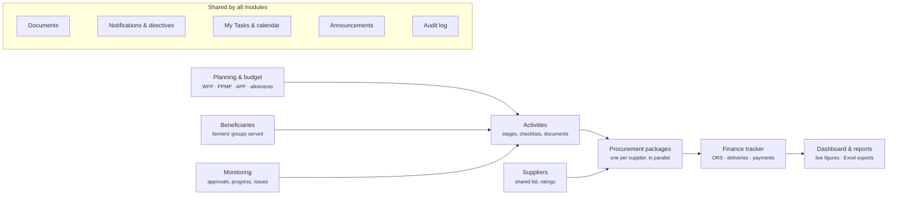
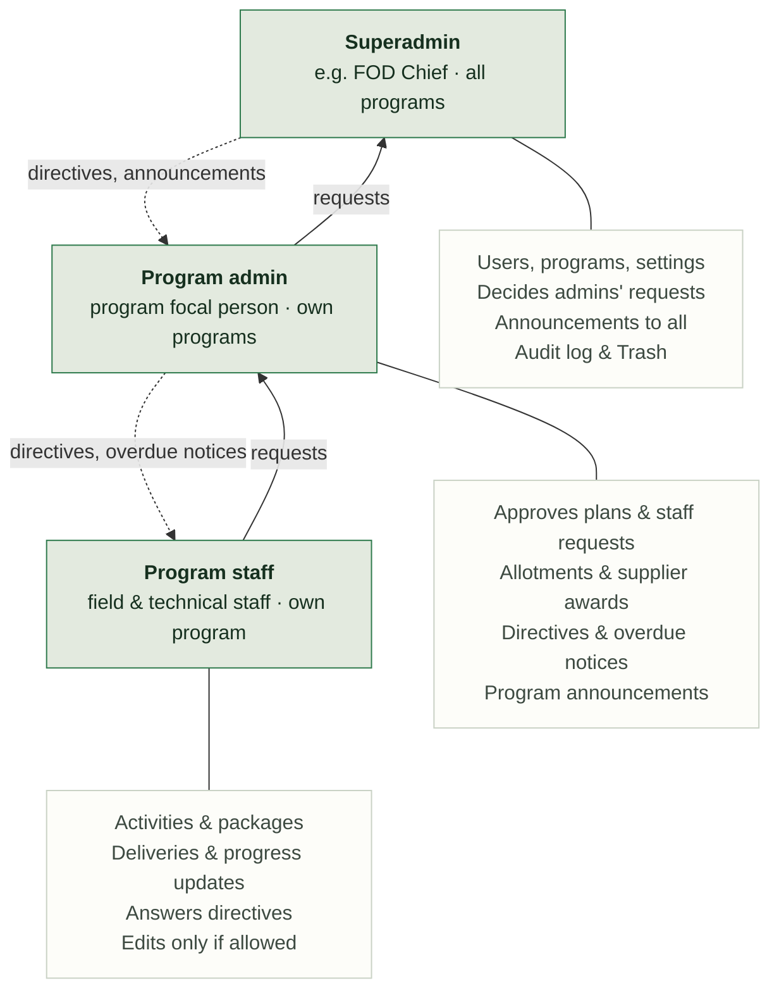
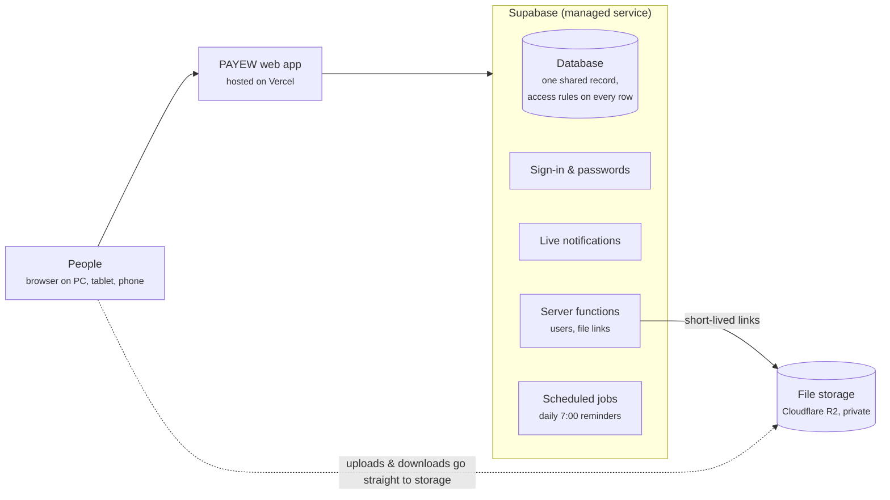

# PAYEW: presentation materials

Author and presenter: **Alfred Brandon N. Calawa**

Audience: DA-CAR FOD leadership and program staff (non-technical). Every diagram below is Mermaid, so it can be edited and re-rendered. GitHub and VS Code preview it, or paste a block into <https://mermaid.live> to export a PNG or SVG.

**Status, for honest framing:** all twelve build phases are implemented and covered by 200 automated tests, on test data. The system is **not yet deployed to production**. Items marked *Next* or *To decide* are not built or not yet decided.

---

## 1. One-slide system overview

**PAYEW: Program & Allotment Yearly Execution Watch.** The DA-CAR Field Operations Division's own system for planning, implementing, procuring, paying for and reporting on program activities. *"Payew" is the Ifugao word for the rice terraces. Tagline: Every peso, every step, tracked.*

| Plan | Carry out | Buy & pay | Report |
| --- | --- | --- | --- |
| Work & financial plans (WFP), procurement plans (PPMP, APP), budget allotments per program and year | Activities move through set stages with checklists, documents, progress updates and issues | Each supplier's package: award → delivery → inspection → obligation (ORS) → payment (DV) | Live dashboard, nine Excel-ready reports, calendar, personal task list |

- **Five programs:** AMIA · APA · HVC · RICE · CORN
- **Three roles:** superadmin, program admin, program staff
- **One shared record:** a figure on the dashboard is the same figure in the reports and in the activity

---

## 2. Main modules and how they connect

*Note:* the middle row is the flow of work and money. Monitoring also covers packages and allotments (approval requests); the diagram shows only the main link to keep it readable.

---

## 3. Workflow: from planning to reporting

```mermaid
flowchart LR
    subgraph BUDGET["Program & budget"]
        direction TB
        S1["1 · Plan<br/><small>WFP, PPMP, APP approved</small>"]
        S2["2 · Allot<br/><small>SARO / sub-allotments</small>"]
        S1 --> S2
    end
    subgraph ACTIVITY["Activity"]
        S3["3 · Set up activity<br/><small>dates, budget, beneficiaries</small>"]
    end
    subgraph PACKAGE["Each supplier's package (repeats, in parallel)"]
        direction TB
        S4["4 · Procure<br/><small>request, quotations, award</small>"]
        S5["5 · Deliver & inspect<br/><small>DR, IAR</small>"]
        S6["6 · Obligate<br/><small>ORS</small>"]
        S7["7 · Pay<br/><small>DV, staged payments OK</small>"]
        S4 --> S5 --> S6 --> S7
    end
    subgraph RESULTS["Results"]
        S8["8 · Report & close<br/><small>dashboard, reports, savings</small>"]
    end
    S2 --> S3 --> S4
    S7 --> S8
```

*Notes:*
- Per package, the ORS can also come **before** delivery, at award. Admins set the order per package.
- Money checks at steps 5–7: ORS ≤ contract, budget and allotment; payment ≤ unpaid ORS. The admin chooses *warn* or *block*.
- The activity's "Procurement & Implementation" stage completes by itself when all its packages are closed or cancelled.

---

## 4. User roles

*Everyone* gets My Tasks, the calendar, the dashboard, reports and the user guide, limited to their own programs. The database enforces these limits, not only the screen.

---

## 5. High-level architecture

*Technical notes (for IT):* React + TypeScript front end. Postgres with row-level security and security-invoker views. Supabase Edge Functions (Deno) for user administration and presigned R2 URLs that expire in ≤ 10 minutes. pg_cron runs the daily sweep, finance and monitoring reminders, and hourly announcements. Setup steps are in `docs/DEPLOYMENT.md`.

---

## 6. Slide outline with speaker notes

| # | Slide | Speaker notes |
| --- | --- | --- |
| 1 | **PAYEW: Program & Allotment Yearly Execution Watch** (cover) | "Payew" is the Ifugao word for the rice terraces. The system follows each program step by step, and the money level by level: allotment → obligation → payment → savings. Agenda: what it does, how work flows, who uses it, how it runs, what's left before go-live. |
| 2 | **What PAYEW does** (overview, section 1 above) | One shared record for planning, implementation, procurement, payments and reporting across the five programs. Four jobs: plan, carry out, buy & pay, report. The dashboard figure is the same figure as in the reports and the activity. |
| 3 | **The main modules and how they connect** (diagram 2) | Read the middle row left to right: plans and budget → activities → supplier packages → finance tracker → dashboard and reports. Above: shared beneficiary and supplier lists. Below: monitoring. Bottom band: what every module shares. |
| 4 | **From plan to payment to report** (diagram 3) | Eight steps. Budget (1–2), activity (3), each supplier's package (4–7), results (8). Steps 4–7 repeat per supplier and don't wait for each other. The ORS may come before delivery, set per package. |
| 5 | **One activity, many suppliers** (illustrative example) | A training buys meals, lodging, transport and venue from different suppliers. Each package has its own ten steps: meals can be paid while transport is still collecting quotations. The activity moves on by itself when all packages are closed or cancelled; an admin can override with a recorded reason. *Example names are illustrative.* |
| 6 | **Built-in checks keep the record reliable** | Money checks (warn or block); approvals for schedule- and money-changing requests, applied automatically when approved; daily 7:00 reminders with three-level escalation; full audit log and restorable Trash. |
| 7 | **Who uses PAYEW** (diagram 4) | Superadmin, program admin, program staff. Requests go up one level for a decision; nobody decides their own. Directives and overdue notices come down. Staff edit only if allowed. Access limits are enforced by the database. |
| 8 | **How it runs** (diagram 5) | Three hosted services, nothing to install: web app on Vercel, data and sign-in on Supabase, files on Cloudflare R2. Access rules are checked on the server. Files go straight to private storage through links that expire within ten minutes. |
| 9 | **Where we are** | *Built and tested:* all twelve phases, 200 automated tests, on test data. *Before go-live (Next):* set up production services; import the official PSA (PSGC) location list; create the fiscal year and user accounts; verify UACS codes. *To decide:* pilot programs and training dates. *Later, optional:* two-step sign-in for superadmins; stricter browser security policy. |
| 10 | **Every peso, every step, tracked.** (closing) | Next: production setup → locations and accounts → pilot → rollout. Decisions needed: pilot programs [__], go-live date [__], owner of user accounts and master lists [__]. Questions. |

Placeholders in square brackets, like `[Date]`, `[Contact person]` and `[__]`, are for you to fill in.
